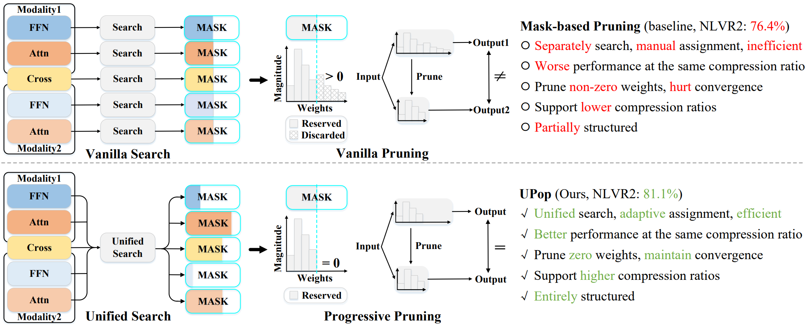

# UPop: Unified and Progressive Pruning for Compressing Vision-Language Transformers



Official implementation of [UPop: Unified and Progressive Pruning for Compressing Vision-Language Transformers](https://arxiv.org/abs/2301.13741). UPop enables effective **structured pruning on various multi-modal and uni-modal tasks**. 


### What's New 🥳
* Jun 2023, we worked on a new project CrossGET: Cross-Guided Ensemble of Tokens for Accelerating Vision-Language Transformers. CrossGET reduces token computational costs effectively for accelerating. [[Paper]](https://arxiv.org/pdf/2305.17455.pdf). [[Code(coming soon)]](https://github.com/sdc17/CrossGET).  💡

* Jun 2023, we released the ```implementation```, ```scripts```, ```checkpoints```, and ```logs``` of UPop. [[Code]](https://github.com/sdc17/UPop). 🚩

* Apr 2023, our work UPop: Unified and Progressive Pruning for Compressing Vision-Language Transformers was accepted by ICML 2023. [[Paper]](https://arxiv.org/pdf/2301.13741.pdf). 🎉


### Installation
The code is tested on `Pytorch==1.11.0`, `cuda==11.3.1`, and `python==3.8.13`. The dependencies can be installed by <pre/> conda install --yes --file requirements.txt </pre> 

### Supported Tasks, Models, and Datasets
|  Supported Tasks | Supported Models  | Supported Datasets |
--- | :---: | :---: 
[Visual Reasoning](https://github.com/sdc17/UPop#visual-reasoning-on-the-nlvr2-dataset) | [BLIP](https://github.com/salesforce/BLIP) ([instructions](https://github.com/sdc17/UPop#visual-reasoning-on-the-nlvr2-dataset)) | NLVR2 
[Image Caption](https://github.com/sdc17/UPop#image-caption-on-the-coco-caption-dataset) | [BLIP](https://github.com/salesforce/BLIP) ([instructions](https://github.com/sdc17/UPop#image-caption-on-the-coco-caption-dataset)) | COCO Caption
[Visual Question Answer](https://github.com/sdc17/UPop#image-caption-on-the-coco-caption-dataset) | [BLIP](https://github.com/salesforce/BLIP) ([instructions](https://github.com/sdc17/UPop#image-caption-on-the-coco-caption-dataset)) | VQAv2
[Image-Text Retrieval](https://github.com/sdc17/UPop#image-text-&-text-image-retrieval-on-the-coco-dataset) | [CLIP](https://github.com/openai/CLIP) ([instructions](https://github.com/sdc17/UPop#image-text-retrieval-on-the-coco-dataset-with-clip)), [BLIP](https://github.com/salesforce/BLIP) ([instructions](https://github.com/sdc17/UPop#image-text-retrieval-on-the-coco-dataset)) | COCO, Flickr30k
[Text-Image Retrieval](https://github.com/sdc17/UPop#image-text-retrieval-on-the-coco-dataset) | [CLIP](https://github.com/openai/CLIP) ([instructions](https://github.com/sdc17/UPop#image-text-retrieval-on-the-flickr30k-dataset-with-clip)), [BLIP](https://github.com/salesforce/BLIP) ([instructions](https://github.com/sdc17/UPop#image-text-retrieval-on-the-flickr30k-dataset)) | COCO, Flickr30k
Image Classification | [DeiT](https://github.com/facebookresearch/deit) | ImageNet
Image Segmentation | [Segmenter](https://github.com/rstrudel/segmenter) | ADE20k

### Visual Reasoning on the NLVR2 Dataset

* Dataset & Annotation

    Download the NLVR2 dataset, unzip it under the `datasets` folder, and accordingly modify the `image_root` in [config](./configs/nlvr.yaml). Download all-in-one annotations (including annotations for Visual Reasoning, Image Caption, VQA, Image-Text Retrieval, and Text-Image Retrieval tasks) from [this link](https://drive.google.com/uc?export=download&id=19Vk07K3DbQYa68DipJ4dFNcF0_Br7cmD), unzip it under the `annotation` folder, and accordingly modify the `annotation` in [config](./configs/nlvr.yaml).

* Evaluation
  
    Download compressed checkpoints from the table below, put them under the `output` folder, and accordingly modify the `--pretrained` of the scripts. For example, to evaluate a 2x compressed model: 
    ```bash
    python -m torch.distributed.run --nproc_per_node=8 compress_nlvr.py --evaluate \
    --pretrained output/nlvr_nlvr2_compression_2x/model_base_nlvr_nlvr2_2x_compressed.pth \
    --config ./configs/nlvr.yaml \
    --output_dir output/nlvr_nlvr2_compression_2x
    ```

* Compression
  
    Download the uncompressed model from the table below, put it under the `pretrained` folder, and accordingly modify the `pretrained` in [config](./configs/nlvr.yaml). For example, to conduct a 2x compression on 8 A100 GPUs:
    ```bash
    python -m torch.distributed.run --nproc_per_node=8 compress_nlvr.py --p 0.5 --epoch 15 \
    --pretrained pretrained/model_base_nlvr.pth \
    --config ./configs/nlvr.yaml \
    --output_dir output/nlvr_nlvr2_compression_2x
    ```

* Resources

    Reduction | Uncompressed Model | Compression Script | Training Log | Compressed Checkpoint | Evaluation Script
    --- | :---: | :---: | :---: | :---: | :---: 
    2x | <a href="https://drive.google.com/uc?export=download&id=1pcsvlNRzzoq_q6Kaku_Kkg1MFELGoIxE">Download</a> | [Link](./scripts/compress_nlvr_nlvr2_2x.sh) | <a href="https://drive.google.com/uc?export=download&id=10Olyj0IBji3t2QwL85FK-gwjfm87k7tT">Download</a> | <a href="https://drive.google.com/uc?export=download&id=1HIh45vjaNUSy20uPSg_rtXtAlV9w7VB4">Download</a> | [Link](./scripts/evaluate_nlvr_nlvr2_2x_compressed.sh)
    3x | <a href="https://drive.google.com/uc?export=download&id=1pcsvlNRzzoq_q6Kaku_Kkg1MFELGoIxE">Download</a> | [Link](./scripts/compress_nlvr_nlvr2_3x.sh) | <a href="https://drive.google.com/uc?export=download&id=1amXIX9bXMiWSopkHRbVUHHqJDfkBxRie">Download</a> | <a href="https://drive.google.com/uc?export=download&id=1fdCW-HrsPrqpHpCCvypgKTOePjPdtKOc">Download</a> | [Link](./scripts/evaluate_nlvr_nlvr2_3x_compressed.sh)
    4x | <a href="https://drive.google.com/uc?export=download&id=1pcsvlNRzzoq_q6Kaku_Kkg1MFELGoIxE">Download</a> | [Link](./scripts/compress_nlvr_nlvr2_4x.sh)| <a href="https://drive.google.com/uc?export=download&id=1bSqP6ODlUiT24ACN3nN0HuGx341YJI9B">Download</a> | <a href="https://drive.google.com/uc?export=download&id=1OaHw4Bn1Kp1EfR6L3f1Xby-i2MO-_oJs">Download</a> | [Link](./scripts/evaluate_nlvr_nlvr2_4x_compressed.sh)
    5x | <a href="https://drive.google.com/uc?export=download&id=1pcsvlNRzzoq_q6Kaku_Kkg1MFELGoIxE">Download</a> | [Link](./scripts/compress_nlvr_nlvr2_5x.sh)| <a href="https://drive.google.com/uc?export=download&id=16rmyQ1sGZma5_VoXT6ew5T72053wxwQ3">Download</a> | <a href="https://drive.google.com/uc?export=download&id=1eAvTeJH8EOvjJMwpFw66tPsOPodPZT2a">Download</a> | [Link](./scripts/evaluate_nlvr_nlvr2_5x_compressed.sh)
    10x | <a href="https://drive.google.com/uc?export=download&id=1pcsvlNRzzoq_q6Kaku_Kkg1MFELGoIxE">Download</a> | [Link](./scripts/compress_nlvr_nlvr2_10x.sh) | <a href="https://drive.google.com/uc?export=download&id=1g4FRQKkrn_8zPGLdN0S1-AQaCasUuWeR">Download</a> | <a href="https://drive.google.com/uc?export=download&id=12Exrv25avoZxXrmx4JhWMVXfRUpu-qSE">Download</a> | [Link](./scripts/evaluate_nlvr_nlvr2_10x_compressed.sh)


### Image Caption on the COCO Caption Dataset

* Dataset & Annotation

    Download the COCO dataset, unzip it under the `datasets` folder, and accordingly modify the `image_root` in [config](./configs/caption_coco.yaml). Download all-in-one annotations  from [this link](https://drive.google.com/uc?export=download&id=19Vk07K3DbQYa68DipJ4dFNcF0_Br7cmD), unzip it under the `annotation` folder, and accordingly modify the `annotation` in [config](./configs/caption_coco.yaml).

* Evaluation
  
    Download compressed checkpoints from the table below, put them under the `output` folder, and accordingly modify the `--pretrained` of the scripts. For example, to evaluate a 2x compressed model: 
    ```bash
    python -m torch.distributed.run --nproc_per_node=8 compress_caption.py --evaluate \
    --pretrained output/caption_coco_compression_2x/model_base_caption_capfilt_large_coco_2x_compressed.pth \
    --config ./configs/caption_coco.yaml \
    --output_dir output/caption_coco_compression_2x
    ```

* Compression
  
    Download the uncompressed model from the table below, put it under the `pretrained` folder, and accordingly modify the `pretrained` in [config](./configs/caption_coco.yaml). For example, to conduct a 2x compression on 8 A100 GPUs:
    ```bash
    python -m torch.distributed.run --nproc_per_node=8 compress_caption.py --p 0.5 --epoch 5 \
    --pretrained pretrained/model_base_caption_capfilt_large.pth \
    --config ./configs/caption_coco.yaml \
    --output_dir output/caption_coco_compression_2x
    ```

* Resources

    Reduction | Uncompressed Model | Compression Script | Training Log | Compressed Checkpoint | Evaluation Script
    --- | :---: | :---: | :---: | :---: | :---: 
    2x | <a href="https://drive.google.com/uc?export=download&id=1qW_0DpQsDc6u9g3fSfTI4g_VXYsMA5s8">Download</a> | [Link](./scripts/compress_caption_coco_2x.sh) | <a href="https://drive.google.com/uc?export=download&id=1LkaQ1xGEdUvoVo_frvHT5rJDR6TqaoMr">Download</a> | <a href="https://drive.google.com/uc?export=download&id=1GoztmYFYNsU0FdsTs3_mYfx4t1fS7o6E">Download</a> | [Link](./scripts/evaluate_caption_coco_2x_compressed.sh)
    4x | <a href="https://drive.google.com/uc?export=download&id=1qW_0DpQsDc6u9g3fSfTI4g_VXYsMA5s8">Download</a> | [Link](./scripts/compress_caption_coco_4x.sh)| <a href="https://drive.google.com/uc?export=download&id=1kPggFkmnikveSn20dKXOjTrJbakaZBAl">Download</a> | <a href="https://drive.google.com/uc?export=download&id=1Pp947bX2yVApghKCJi5DJB0YsDGDgiTz">Download</a> | [Link](./scripts/evaluate_caption_coco_4x_compressed.sh)
    


### Visual Question Answer on the VQAv2 Dataset

* Dataset & Annotation

    Download the VQAv2 dataset and Visual Genome dataset, unzip them under the `datasets` folder, and accordingly modify the `image_root` in [config](./configs/vqa.yaml). Download all-in-one annotations  from [this link](https://drive.google.com/uc?export=download&id=19Vk07K3DbQYa68DipJ4dFNcF0_Br7cmD), unzip it under the `annotation` folder, and accordingly modify the `annotation` in [config](./configs/vqa.yaml).

* Evaluation
  
    Download compressed checkpoints from the table below, put them under the `output` folder, and accordingly modify the `--pretrained` of the scripts. For example, to evaluate a 2x compressed model: (note that the scripts will generate answers `vqa_result.json`, which should be submitted to the [official server](https://eval.ai/web/challenges/challenge-page/830/overview) to obtain evaluation results.)
    ```bash
    python -m torch.distributed.run --nproc_per_node=8 compress_vqa.py --evaluate \
    --pretrained output/vqa_vqa2_compression_2x/model_base_vqa_capfilt_large_vqa2_2x_compressed.pth \
    --config ./configs/vqa.yaml \
    --output_dir output/vqa_vqa2_compression_2x
    ```

* Compression
  
    Download the uncompressed model from the table below, put it under the `pretrained` folder, and accordingly modify the `pretrained` in [config](./configs/vqa.yaml). For example, to conduct a 2x compression on 8 A100 GPUs:
    ```bash
    python -m torch.distributed.run --nproc_per_node=8 compress_vqa.py --p 0.5 --epoch 10 \
    --pretrained pretrained/model_base_vqa_capfilt_large.pth \
    --config ./configs/vqa.yaml \
    --output_dir output/vqa_vqa2_compression_2x
    ```

* Resources

    Reduction | Uncompressed Model | Compression Script | Training Log | Compressed Checkpoint | Evaluation Script
    --- | :---: | :---: | :---: | :---: | :---: 
    2x | <a href="https://drive.google.com/uc?export=download&id=18Ihg2NA_puj3_92uVszqonSusLFgmID-">Download</a> | [Link](./scripts/compress_vqa_vqa2_2x.sh) | <a href="https://drive.google.com/uc?export=download&id=1Qmv73cTvzU3AQbUer9Jjekebzc4U175C">Download</a> | <a href="https://drive.google.com/uc?export=download&id=1K1OAD2y2h8WHYwp6r0A4WRcS654FfKYr">Download</a> | [Link](./scripts/evaluate_vqa_vqa2_2x_compressed.sh)
    4x | <a href="https://drive.google.com/uc?export=download&id=18Ihg2NA_puj3_92uVszqonSusLFgmID-">Download</a> | [Link](./scripts/compress_vqa_vqa2_4x.sh)| <a href="https://drive.google.com/uc?export=download&id=1_VDsABugk9LNt9mMUD5Z_BuO4Ir9V2_k">Download</a> | <a href="https://drive.google.com/uc?export=download&id=1abiAFOZtK64HSMe9JHffwY7e_7M86PJU">Download</a> | [Link](./scripts/evaluate_vqa_vqa2_4x_compressed.sh)
    

### Image-Text & Text-Image Retrieval on the COCO Dataset

* Dataset & Annotation

    Download the COCO dataset, unzip it under the `datasets` folder, and accordingly modify the `image_root` in [config](./configs/retrieval_coco.yaml). Download all-in-one annotations  from [this link](https://drive.google.com/uc?export=download&id=19Vk07K3DbQYa68DipJ4dFNcF0_Br7cmD), unzip it under the `annotation` folder, and accordingly modify the `annotation` in [config](./configs/retrieval_coco.yaml).

* Evaluation
  
    Download compressed checkpoints from the table below, put them under the `output` folder, and accordingly modify the `--pretrained` of the scripts. For example, to evaluate a 2x compressed model:
    ```bash
    python -m torch.distributed.run --nproc_per_node=8 compress_retrieval.py --evaluate \
    --pretrained output/retrieval_coco_compression_2x/model_base_retrieval_coco_2x_compressed.pth --config ./configs/retrieval_coco.yaml \
    --output_dir output/retrieval_coco_compression_2x
    ```

* Compression
  
    Download the uncompressed model from the table below, put it under the `pretrained` folder, and accordingly modify the `pretrained` in [config](./configs/retrieval_coco.yaml). For example, to conduct a 2x compression on 8 A100 GPUs:
    ```bash
    python -m torch.distributed.run --nproc_per_node=8 compress_retrieval.py --p 0.5 --epoch 6 \
    --pretrained pretrained/model_base_retrieval_coco.pth \
    --config ./configs/retrieval_coco.yaml \
    --output_dir output/retrieval_coco_compression_2x
    ```

* Resources

    Reduction | Uncompressed Model | Compression Script | Training Log | Compressed Checkpoint | Evaluation Script
    --- | :---: | :---: | :---: | :---: | :---: 
    2x | <a href="https://drive.google.com/uc?export=download&id=19nxvphpnIH2kbV4unL0MDAM_2zlBnruq">Download</a> | [Link](./scripts/compress_retrieval_coco_2x.sh) | <a href="https://drive.google.com/uc?export=download&id=1EACJZO2QdbcLkBr6uvZq_z8A4vXzc8yK">Download</a> | <a href="https://drive.google.com/uc?export=download&id=1tDo3gk4IQUHgm21RbK96Qg-haEFBAgBX">Download</a> | [Link](./scripts/evaluate_retrieval_coco_2x_compressed.sh)
    4x | <a href="https://drive.google.com/uc?export=download&id=19nxvphpnIH2kbV4unL0MDAM_2zlBnruq">Download</a> | [Link](./scripts/compress_retrieval_coco_4x.sh)| <a href="https://drive.google.com/uc?export=download&id=1-OA-xkLbzH39GPfrVFux3wNZ9h0GwyJX">Download</a> | <a href="https://drive.google.com/uc?export=download&id=1G5FFff4r5lT0WhUXmxfO8nOUtNgwD_PY">Download</a> | [Link](./scripts/evaluate_retrieval_coco_4x_compressed.sh)
    

### Image-Text & Text-Image Retrieval on the Flickr30K Dataset

* Dataset & Annotation

    Download the Flickr30K dataset, unzip it under the `datasets` folder, and accordingly modify the `image_root` in [config](./configs/retrieval_flickr.yaml). Download all-in-one annotations  from [this link](https://drive.google.com/uc?export=download&id=19Vk07K3DbQYa68DipJ4dFNcF0_Br7cmD), unzip it under the `annotation` folder, and accordingly modify the `annotation` in [config](./configs/retrieval_flickr.yaml).

* Evaluation
  
    Download compressed checkpoints from the table below, put them under the `output` folder, and accordingly modify the `--pretrained` of the scripts. For example, to evaluate a 2x compressed model:
    ```bash
    python -m torch.distributed.run --nproc_per_node=8 compress_retrieval_flickr.py --evaluate \
    --pretrained output/retrieval_flickr_compression_2x/model_base_retrieval_flickr_2x_compressed.pth \
    --config ./configs/retrieval_flickr.yaml \
    --output_dir output/retrieval_flickr_compression_2x
    ```

* Compression
  
    Download the uncompressed model from the table below, put it under the `pretrained` folder, and accordingly modify the `pretrained` in [config](./configs/retrieval_flickr.yaml). For example, to conduct a 2x compression on 8 A100 GPUs:
    ```bash
    python -m torch.distributed.run --nproc_per_node=8 compress_retrieval_flickr.py --p 0.5 --epoch 12 \
    --pretrained pretrained/model_base_retrieval_flickr.pth \
    --config ./configs/retrieval_flickr.yaml \
    --output_dir output/retrieval_flickr_compression_2x
    ```

* Resources

    Reduction | Uncompressed Model | Compression Script | Training Log | Compressed Checkpoint | Evaluation Script
    --- | :---: | :---: | :---: | :---: | :---: 
    2x | <a href="https://drive.google.com/uc?export=download&id=1mrd7unZMFMC77Qb_3DAx7MhpZJv4Ptbw">Download</a> | [Link](./scripts/compress_retrieval_flickr_2x.sh) | <a href="https://drive.google.com/uc?export=download&id=1FnJNt5RqFPVEjCBmikKPSu1vzRsf-kN9">Download</a> | <a href="https://drive.google.com/uc?export=download&id=1mOTbG_zvIAD3itJI1oo_0r55W3PeRy5b">Download</a> | [Link](./scripts/evaluate_retrieval_flickr_2x_compressed.sh)
    4x | <a href="https://drive.google.com/uc?export=download&id=1mrd7unZMFMC77Qb_3DAx7MhpZJv4Ptbw">Download</a> | [Link](./scripts/compress_retrieval_flickr_4x.sh)| <a href="https://drive.google.com/uc?export=download&id=1DHoUwUjKyNlm-QWdIMJKCQdBcC1vQY_F">Download</a> | <a href="https://drive.google.com/uc?export=download&id=1mSSbvS3SkR334xxdtee0p61bRfOgjgyG">Download</a> | [Link](./scripts/evaluate_retrieval_flickr_4x_compressed.sh)


### Image-Text & Text-Image Retrieval on the COCO Dataset with CLIP

* Dataset & Annotation

    Download the COCO dataset, unzip it under the `datasets` folder, and accordingly modify the `image_root` in [config](./configs/retrieval_coco_clip.yaml). Download all-in-one annotations  from [this link](https://drive.google.com/uc?export=download&id=19Vk07K3DbQYa68DipJ4dFNcF0_Br7cmD), unzip it under the `annotation` folder, and accordingly modify the `annotation` in [config](./configs/retrieval_coco_clip.yaml).

* Evaluation
  
    Download compressed checkpoints from the table below, put them under the `output` folder, and accordingly modify the `--pretrained` of the scripts. For example, to evaluate a 2x compressed model:
    ```bash
    python -m torch.distributed.run --nproc_per_node=8 compress_retrieval_clip.py --evaluate \
    --pretrained output/retrieval_coco_clip_compression_2x/clip_large_retrieval_coco_2x_compressed.pth \
    --config ./configs/retrieval_coco_clip.yaml \
    --output_dir output/retrieval_coco_clip_compression_2x
    ```

* Compression
  
    Download the uncompressed model from the table below, put it under the `pretrained` folder, and accordingly modify the `pretrained` in [config](./configs/retrieval_coco_clip.yaml). For example, to conduct a 2x compression on 8 A100 GPUs:
    ```bash
    python -m torch.distributed.run --nproc_per_node=8 compress_retrieval_clip.py --p 0.5 --epoch 6 \
    --pretrained pretrained/clip_large_retrieval_coco.pth \
    --config ./configs/retrieval_coco_clip.yaml \
    --output_dir output/retrieval_coco_clip_compression_2x
    ```

* Resources

    Reduction | Uncompressed Model | Compression Script | Training Log | Compressed Checkpoint | Evaluation Script
    --- | :---: | :---: | :---: | :---: | :---: 
    2x | <a href="https://drive.google.com/uc?export=download&id=10p1oPdiMUqo0MfPul5hCb_h9mCaNCh6q">Download</a> | [Link](./scripts/compress_retrieval_coco_clip_2x.sh) | <a href="https://drive.google.com/uc?export=download&id=1EACJZO2QdbcLkBr6uvZq_z8A4vXzc8yK">Download</a> | <a href="https://drive.google.com/uc?export=download&id=184sBFSArAXfxkd8ZqlF8xsZCOOsNmT0z">Download</a> | [Link](./scripts/evaluate_retrieval_coco_clip_2x_compressed.sh)
    4x | <a href="https://drive.google.com/uc?export=download&id=10p1oPdiMUqo0MfPul5hCb_h9mCaNCh6q">Download</a> | [Link](./scripts/compress_retrieval_coco_clip_4x.sh)| <a href="https://drive.google.com/uc?export=download&id=1-OA-xkLbzH39GPfrVFux3wNZ9h0GwyJX">Download</a> | <a href="https://drive.google.com/uc?export=download&id=1C3LRQZ2IP7St813ERH7LidTcQP99xhKw">Download</a> | [Link](./scripts/evaluate_retrieval_coco_clip_4x_compressed.sh)


### Image-Text & Text-Image Retrieval on the Flickr30K Dataset with CLIP

* Dataset & Annotation

    Download the Flickr30K dataset, unzip it under the `datasets` folder, and accordingly modify the `image_root` in [config](./configs/retrieval_flickr_clip.yaml). Download all-in-one annotations  from [this link](https://drive.google.com/uc?export=download&id=19Vk07K3DbQYa68DipJ4dFNcF0_Br7cmD), unzip it under the `annotation` folder, and accordingly modify the `annotation` in [config](./configs/retrieval_flickr_clip.yaml).

* Evaluation
  
    Download compressed checkpoints from the table below, put them under the `output` folder, and accordingly modify the `--pretrained` of the scripts. For example, to evaluate a 2x compressed model:
    ```bash
    python -m torch.distributed.run --nproc_per_node=8 compress_retrieval_clip.py --evaluate \
    --pretrained output/retrieval_flickr_clip_compression_2x/clip_large_retrieval_flickr_2x_compressed.pth \
    --config ./configs/retrieval_flickr_clip.yaml \
    --output_dir output/retrieval_flickr_clip_compression_2x
    ```

* Compression
  
    Download the uncompressed model from the table below, put it under the `pretrained` folder, and accordingly modify the `pretrained` in [config](./configs/retrieval_flickr_clip.yaml). For example, to conduct a 2x compression on 8 A100 GPUs:
    ```bash
    python -m torch.distributed.run --nproc_per_node=8 compress_retrieval_clip.py --p 0.5 --epoch 12 \
    --pretrained pretrained/clip_large_retrieval_flickr.pth \
    --config ./configs/retrieval_flickr_clip.yaml \
    --output_dir output/retrieval_flickr_clip_compression_2x
    ```

* Resources

    Reduction | Uncompressed Model | Compression Script | Training Log | Compressed Checkpoint | Evaluation Script
    --- | :---: | :---: | :---: | :---: | :---: 
    2x | <a href="https://drive.google.com/uc?export=download&id=1-MZP6xQRnmLZr1_pqUK4TvOA8Ic7XCoI">Download</a> | [Link](./scripts/compress_retrieval_flickr_clip_2x.sh) | <a href="https://drive.google.com/uc?export=download&id=1pE48hKlW0VI37_ebxhqBm-YVqEfFccQ4">Download</a> | <a href="https://drive.google.com/uc?export=download&id=1kZjCv4Y9Cars7U3PL9gXP7XJsqJMyLeD">Download</a> | [Link](./scripts/evaluate_retrieval_flickr_clip_2x_compressed.sh)
    4x | <a href="https://drive.google.com/uc?export=download&id=1-MZP6xQRnmLZr1_pqUK4TvOA8Ic7XCoI">Download</a> | [Link](./scripts/compress_retrieval_flickr_clip_4x.sh)| <a href="https://drive.google.com/uc?export=download&id=1pSCr8OVzPsvnL2IEIhpBxJAKTAZ1_iCD">Download</a> | <a href="https://drive.google.com/uc?export=download&id=1YUkN-zz6iFxquJeYKcxbETFTbWM14KWK">Download</a> | [Link](./scripts/evaluate_retrieval_flickr_clip_4x_compressed.sh)


### Acknowledgments
This code is built upon <a href="https://github.com/salesforce/BLIP">BLIP</a>, <a href="https://github.com/openai/CLIP">CLIP</a>, and <a href="https://github.com/facebookresearch/fvcore">fvcore</a>. We thank the original authors for their open-source work.


### Citation
If you find this work useful, please consider citing the corresponding paper:
```bibtex
@article{shi2023upop,
  title={Upop: Unified and progressive pruning for compressing vision-language transformers},
  author={Shi, Dachuan and Tao, Chaofan and Jin, Ying and Yang, Zhendong and Yuan, Chun and Wang, Jiaqi},
  journal={arXiv preprint arXiv:2301.13741},
  year={2023}
}
```

